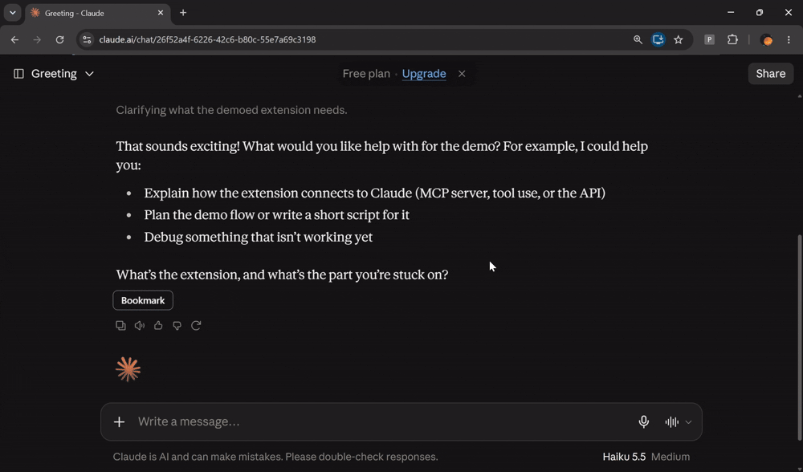

# Prompts Bookmarks Extension

Chrome extension (Manifest V3, built with WXT) that bookmarks a Claude prompt and its response from claude.ai. Everything is stored locally with `chrome.storage.local`.



## Run it

```bash
pnpm install
pnpm build
```

Then open `chrome://extensions`, switch on **Developer mode**, click **Load unpacked** and choose `.output/chrome-mv3`.

For hot reload while developing, run `pnpm dev` (WXT opens a Chrome window with the extension loaded; you'll need to sign in to claude.ai there).

Other scripts: `pnpm test`, `pnpm compile` (type-check).

## Where things live

| File | Job |
|---|---|
| `utils/selectors.ts` | Every claude.ai selector. If the extension breaks after a Claude update, fix it here. |
| `utils/extract.ts` | Finds the prompt above a response and cleans the text |
| `utils/settle.ts` | Detects when a response has finished streaming |
| `entrypoints/content.ts` | Adds the Bookmark button to each response |
| `entrypoints/popup/` | The popup: search, copy, open chat, delete |
| `utils/storage.ts` | Reads and writes bookmarks |
| `tests/extract.test.ts` | Fixture-based tests. Update the fixture when Claude's markup changes. |

## Some caveats

- All prompt-response pairs are stored **in plain text** in `chrome.storage.local` so be wary of bookmarking sensitive information.
- This works based on prompt-response pairings within the DOM, if the extension doesn't find the "prompt" or "response" selectors, it won't work.
- This is based on how `claude.ai` **currently** arranges their DOM and how it currently streams tokens, which is subject to change in the future.
- Copying prompts doesn't work yet.
